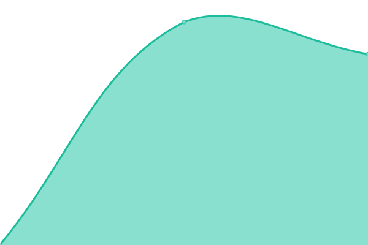

# [📈 Live Status](https://status.structura-systems.com): <!--live status--> **🟧 Partial outage**

This repository contains the open-source uptime monitor and status page for [sebastiancarlson](https://status.structura-systems.com), powered by [Upptime](https://github.com/upptime/upptime).

With [Upptime](https://upptime.js.org), you can get your own unlimited and free uptime monitor and status page, powered entirely by a GitHub repository. We use [Issues](https://github.com/sebastiancarlson/structura-status/issues) as incident reports, [Actions](https://github.com/sebastiancarlson/structura-status/actions) as uptime monitors, and [Pages](https://status.structura-systems.com) for the status page.

<!--start: status pages-->
<!-- This summary is generated by Upptime (https://github.com/upptime/upptime) -->
<!-- Do not edit this manually, your changes will be overwritten -->
<!-- prettier-ignore -->
| URL | Status | History | Response Time | Uptime |
| --- | ------ | ------- | ------------- | ------ |
|  [Structura Platform](https://app.structura-systems.com/api/health) | 🟩 Up | [structura-platform.yml](https://github.com/sebastiancarlson/structura-status/commits/HEAD/history/structura-platform.yml) | 

 2864ms
     
 | 

<a href="https://status.structura-systems.com/history/structura-platform">100.00%</a>
    

|  [Structura Platform Login](https://app.structura-systems.com/login) | 🟩 Up | [structura-platform-login.yml](https://github.com/sebastiancarlson/structura-status/commits/HEAD/history/structura-platform-login.yml) | 

 759ms
     
 | 

<a href="https://status.structura-systems.com/history/structura-platform-login">100.00%</a>
    

|  [Structura Web](https://www.structura-systems.com) | 🟥 Down | [structura-web.yml](https://github.com/sebastiancarlson/structura-status/commits/HEAD/history/structura-web.yml) | 

 0ms
     
 | 

<a href="https://status.structura-systems.com/history/structura-web">0.00%</a>
    

<!--end: status pages-->

[**Visit our status website →**](https://status.structura-systems.com)

## 📄 License

- Powered by: [Upptime](https://github.com/upptime/upptime)
- Code: [MIT](./LICENSE) © [Anand Chowdhary](https://anandchowdhary.com), supported by [Pabio](https://pabio.com)
- Data in the `./history` directory: [Open Database License](https://opendatacommons.org/licenses/odbl/1-0/)
